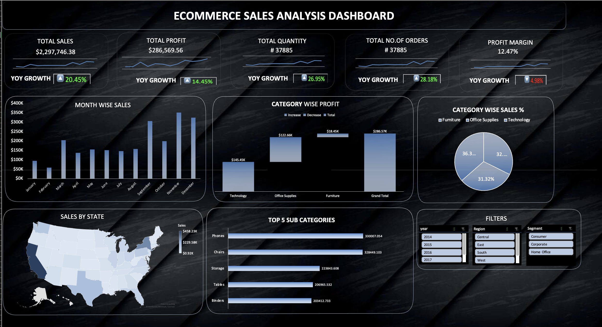

# E-commerce Sales Analysis Dashboard (Excel)

## Project Overview

This project analyzes e-commerce sales data using Microsoft Excel. An interactive dashboard was developed to monitor key performance metrics such as sales, profit, order volume, and growth trends.

The dashboard provides a comprehensive view of business performance across categories, regions, and customer segments, enabling data-driven decision-making.

---

## Business Questions

* What are the total sales, profit, and order volume?
* How is the business performing year-over-year (YoY)?
* Which product categories generate the highest profit?
* What is the category-wise contribution to total sales?
* Which states contribute the most to revenue?
* What are the top-performing sub-categories?
* How do different regions and customer segments perform?

---

## Tools & Techniques Used

* Microsoft Excel
* Pivot Tables
* Pivot Charts
* Slicers (Year, Region, Segment)
* Data Cleaning
* KPI Metrics

---

## Dashboard Preview

---

## Download Dashboard

GitHub cannot preview Excel files.

[Download Excel Dashboard](ecommerce-dashboard.xlsx)

---

## Key Insights

* Total sales reached **$2.29M+**, with a profit of **$286K+**
* Strong YoY growth observed in sales, orders, and quantity
* Technology and Office Supplies contribute significantly to overall profit
* Top-performing states include California and New York
* Sub-categories such as Phones and Chairs generate the highest revenue
* Overall profit margin is approximately **12.47%**

---

## Business Recommendations

* Focus on high-performing sub-categories like Phones and Chairs
* Strengthen operations in top-performing states
* Optimize low-margin categories to improve profitability
* Leverage high-growth segments for targeted marketing
* Improve pricing and discount strategies to increase profit margins

---

## Files Included

* Excel Dashboard File (`ecommerce-dashboard.xlsx`)
* Dashboard Screenshot (`dashboard.png`)

---

## Skills Demonstrated

* Data Analysis
* Data Cleaning
* Dashboard Development
* Data Visualization
* Business Insights
* Microsoft Excel

---

## Project Impact

This dashboard helps stakeholders track business performance, identify growth opportunities, and make informed decisions to improve revenue and profitability.
